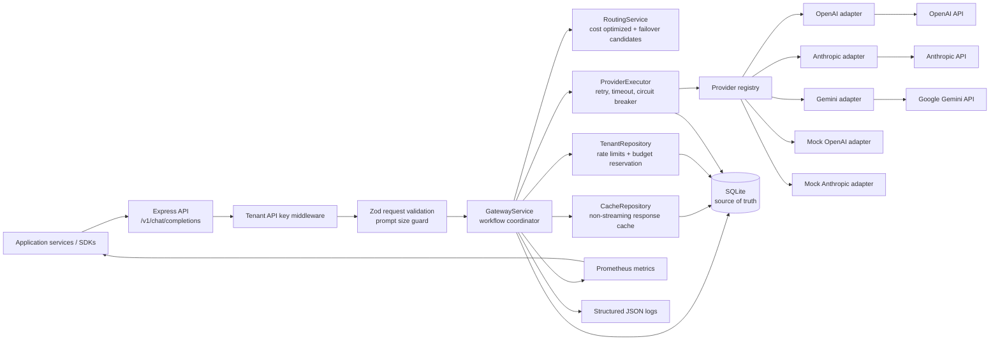
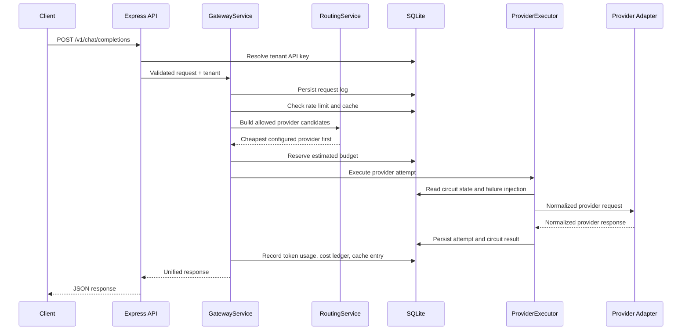

# Multi-Tenant LLM Gateway Design

## 1. Problem Framing

The gateway solves a common problem in AI products: application teams want to call LLMs without spreading provider-specific code, API keys, rate limits, budgets, retries, observability, and failure handling across every product service. This service gives application code one API for chat completions and streaming while the gateway handles provider selection, tenant isolation, accounting, and resilience.

The responsibility boundary is intentionally narrow. The gateway owns provider access, routing, rate limiting, budget enforcement, retries, circuit breakers, response caching, request logs, token usage, and cost records. The application using the gateway still owns product authorization, prompt design, user experience, business data permissions, and final content safety policy. The gateway validates request shape and size, but it does not decide whether a user is allowed to ask a business-specific question.

The service is not trying to become a full commercial gateway clone. It does not include a frontend, organization admin console, full OAuth/JWT implementation, queue workers, Kubernetes manifests, or long-term warehouse analytics. Those are real production needs, but the assignment asks for senior judgment under time pressure. The shipped version focuses on the core backend mechanics that are easiest to evaluate locally.

## 2. Architecture

The service is a TypeScript/Express API with SQLite persistence. The core request path is:

```text
Client
  -> Express route
  -> tenant API key middleware
  -> request schema validation
  -> GatewayService
  -> RoutingService
  -> CacheRepository
  -> TenantRepository budget reservation
  -> ProviderExecutor
  -> provider adapter
  -> usage/cost/request logs
  -> JSON or SSE response
```

The high-level shape is deliberately small:



The non-streaming request flow is:



Streaming follows the same routing, budget, and provider-executor path, but the API writes SSE events as chunks arrive. If a provider fails before emitting any chunk, the gateway can fall back to the next allowed provider. If the upstream drops after chunks have already been sent, the gateway preserves the partial output and emits a terminal SSE error event instead of pretending the request succeeded.

Route handlers stay thin. `src/api/routes.ts` parses inputs and calls services. `GatewayService` owns the business workflow: request creation, prompt size checks, tenant rate limiting, routing, cache lookup, budget reservation, fallback, usage persistence, and final response mapping. `ProviderExecutor` owns provider attempts, retries, timeout handling, circuit breaker state, and failure injection. Provider-specific request and response mapping lives in `src/providers`, so the rest of the code is provider-agnostic.

SQLite is the local source of truth. It stores tenants, API key hashes, provider allowlists, provider configs, circuit breaker state, rate limit windows, request logs, provider attempts, token usage, cost ledger entries, cache entries, and failure injection state. SQLite was chosen because it is real persistence, easy to run locally, inspectable by evaluators, and good enough for assignment concurrency tests. The design keeps repository boundaries clean enough that Postgres or MongoDB could replace it later.

The provider layer includes real OpenAI, Anthropic, and Google Gemini adapters plus mock OpenAI and mock Anthropic adapters. The mock providers make local tests, demos, and failure injection deterministic and free. Real providers are considered configured only when their API keys exist in the environment. Normal routing prefers configured real providers; if no real provider is configured, it falls back to mock providers so the assignment can still be evaluated without spend. A client can also explicitly request a mock provider for local failure-injection demos.

## 3. Key Decisions And Tradeoffs

The first major choice was TypeScript with Express. The JD asks for MERN-style backend strength and Node.js/Express experience. A heavier framework would add conventions that do not matter for this assignment. Express keeps the HTTP layer obvious, and TypeScript gives type safety where it helps: provider contracts, domain types, schema mapping, and service boundaries.

SQLite was chosen over MongoDB for the assignment build. MongoDB would align with the JD, but this gateway needs atomic budget updates, request accounting, and transactional ledger writes. SQLite gives simple local setup and SQL constraints without requiring Docker or an external service. The tradeoff is that SQLite is not the production answer for horizontally scaled gateway workers. The production path would move to Postgres for row-level locking, connection pooling, stronger migrations, and better analytical queries.

The routing policy is cost-optimized routing with failover. If a tenant does not request a provider, the gateway builds allowed and configured candidates, prefers real configured providers when any are available, estimates cost from prompt size and max tokens, then chooses the cheapest candidate. If no real provider is configured, the same policy runs against local mock providers. If the first candidate fails before a non-streaming response is returned, the gateway refunds the budget reservation and tries the next candidate. This is intentionally simple but non-trivial: it proves provider abstraction, tenant allowlists, cost awareness, and graceful fallback. A production system would add latency-weighted routing and per-model quality tiers.

Budget enforcement uses reservation plus adjustment. Before calling a provider, the gateway atomically reserves estimated maximum cost against the tenant budget. After the provider returns, it records actual usage and refunds or charges the delta. This prevents concurrent requests from overspending the same budget. The tradeoff is conservative rejection: a tenant near the budget cap may be rejected even though actual usage might have fit. For an assignment, correctness beats squeezing every last cent from the budget. Production could use finer token estimation and pre-paid reservation buckets.

Caching is tenant-scoped and only applies to non-streaming responses. The cache key includes tenant ID, provider, model, messages, temperature, and max tokens. It does not share prompts across tenants because cross-tenant prompt reuse is a privacy risk. Streaming is not cached in this version because streaming cache replay introduces tricky behavior around partial chunks, final usage records, and client disconnects. A production version could cache full completed streams and replay them as SSE events.

Circuit breakers are per provider and persisted. After repeated provider failures, the circuit opens and later moves to half-open after a reset timeout. Keeping this in SQLite makes state inspectable and restart-safe for the assignment. In a horizontally scaled production deployment, circuit state would likely live in Redis or a control-plane store with careful tuning to avoid every worker stampeding an unhealthy provider at once.

Failure injection is a first-class API because the assignment says evaluators will simulate failures. The gateway supports fail, timeout, slow, and stream-drop modes per provider. This is not a production admin API as-is; it exists to make evaluation pleasant and repeatable. A production version would put this behind strong admin auth or move it into test-only tooling.

The deployment model supports direct `npm` commands, a Makefile, and Docker. Docker is intentionally a thin wrapper around the same Node process with SQLite stored in a volume; it does not introduce Postgres, Redis, Kafka, or a sidecar stack. That keeps clone-to-running time low while still proving the service can run in a repeatable container. The tradeoff is that the Docker Compose file is not a production topology. Production deployment would use a managed database, external cache or limiter, secret manager, dashboards, and proper rollout controls.

## 4. Failure Modes

If OpenAI, Anthropic, or Gemini returns a 5xx, the provider attempt is marked failed, metrics are incremented, the circuit breaker records a failure, and the gateway retries according to the configured retry count. If the request was not pinned to that provider, the gateway can fall back to the next routing candidate. If the client explicitly requested that provider, the error is returned because silently changing an explicit provider can surprise clients.

If a provider is slow but not failing, request timeout protects gateway workers. The provider call is aborted and treated as a retryable failure. Repeated timeouts open the circuit. The client receives either a fallback response or a structured 503/504-style gateway error. Slow streaming is harder: once chunks are flowing, retrying on another provider would duplicate or contradict partial output. The current implementation preserves partial chunks and emits an SSE error event if the stream drops.

If the database is unavailable, the gateway cannot safely authenticate tenants, enforce budgets, or record usage. In this version, that means requests fail rather than bypassing controls. That is the right failure mode for a billing and tenant-isolation service. Production would need health checks, connection pool monitoring, backups, read replicas for analytics, and a clear runbook for degraded modes.

If a tenant sends a very large prompt, the request is rejected before routing or provider calls. The service enforces a configurable character limit and schema validation. This avoids unbounded memory use, surprise provider cost, and slow request hashing. Production would add token-aware limits per model class and perhaps separate limits for system, user, and tool messages.

If two tenants send the same cacheable request, they do not share a cache entry. The tenant ID is part of the cache key. This gives up some cache efficiency but avoids leaking the existence or content of one tenant's prompt to another tenant. If two requests from the same tenant race the same cache key, both may miss and call a provider. That is acceptable for this MVP. Production could add a single-flight lock for hot cache keys.

If budget updates race, SQLite atomic updates protect the cap. A reservation succeeds only when `spent_cents + reservation <= monthly_budget_cents`. If the update affects zero rows, the request is rejected with `budget_exhausted`. Actual usage then adjusts the reservation. Ledger rows make reservations, refunds, and actual usage auditable.

If a process crashes after budget reservation but before refund or actual usage, the reservation remains in `spent_cents`. That is conservative for spend control but bad for customer experience. Production needs a reconciliation job that finds stale running requests, marks them failed, and refunds unused reservations.

## 5. What Was Not Built

I did not build a frontend or admin dashboard. The assignment explicitly says frontend is not graded, and a dashboard would distract from gateway behavior. Admin-like functions are simple HTTP endpoints for provider failure injection and circuit reset.

I did not build full JWT/OAuth user auth. The gateway uses tenant API keys because that is the minimum needed to prove tenant isolation, provider allowlists, budgets, and usage accounting. Production would require key rotation, hashed key prefixes, scoped keys, audit trails, and integration with an identity provider.

I did not build queue-based retries. Synchronous retries are enough to demonstrate backoff and failover. Production would likely move slow retries, reconciliation, and some analytics writes to a queue so request latency is less sensitive to provider or database hiccups.

I did not build distributed rate limiting. Rate limits are persisted in SQLite minute windows and work for a local single-node service. Multi-node production would need Redis, Postgres advisory locks, or another shared limiter.

I did not build a token-perfect estimator. The gateway uses a conservative character-based estimate for budget reservations and records provider usage when returned. Production should use model-specific tokenizers and provider pricing tables with versioned rates.

I did not build Kafka, Redis, Postgres, Celery, Alembic, or Kubernetes into the local assignment runtime. Redis would be useful for distributed cache, rate limits, and circuit state. Postgres would be the next persistence step. Kafka is only justified when usage, audit, and analytics events need multiple durable consumers. Celery and Alembic are Python ecosystem tools, so they are not a natural fit for this TypeScript service unless a future Python worker owns a separate concern. These are documented as future scope rather than hidden inside the MVP.

## 6. Production Gap Analysis

The first production gap is authentication hardening. Tenant keys need prefixes, rotation, scoped permissions, last-used timestamps, revocation workflows, and admin audit logs. Estimated effort: 2-4 days for a practical first pass, longer if integrated into a broader identity platform.

The second gap is database hardening. SQLite should become Postgres with migrations, connection pooling, backups, dashboard queries, and reconciliation jobs for stale reservations. Estimated effort: 3-5 days for the migration and core operational scripts.

The third gap is secrets management. Provider keys should come from a secrets manager, not plain environment variables. The service also needs per-tenant provider credentials if tenants bring their own keys. Estimated effort: 2-4 days depending on cloud provider.

The fourth gap is load and soak testing. The code has integration tests for important behavior, but it does not include a load suite for 1k RPS or long-running stream behavior. Estimated effort: 2-3 days to build k6 or autocannon scenarios and tune bottlenecks.

The fifth gap is production observability. The gateway emits useful metrics and logs, but there are no Grafana dashboards, alert rules, distributed traces, or on-call runbooks. Estimated effort: 2-4 days for dashboards, alerts, and incident docs.

The Dockerfile is a local packaging convenience, not the final deployment story. A production container would need image scanning, pinned base image policy, non-root runtime checks, rollout health gates, resource limits, and cloud-specific secret injection. Estimated effort: 1-2 days for a pragmatic first deployment package after the target cloud is known.

## 7. Scaling Story

At 10 RPS, this design is comfortable. A single Node process and SQLite database can handle the local workload. Provider latency dominates user-facing latency. The main focus at this level is correctness: tenant isolation, budget accounting, retries, logs, and cache behavior.

At 1000 RPS, SQLite becomes the first serious bottleneck because every request touches tenant auth, rate limits, request logs, budget reservations, provider attempts, and usage writes. The next version should move to Postgres, add a connection pool, index high-cardinality query paths, and consider asynchronous writes for non-critical observability records. Rate limiting should move to Redis or another shared limiter. The Node API can scale horizontally once shared state moves out of local SQLite.

At 100k RPS, this is no longer one service with one relational database doing all hot-path writes. The design needs regional API workers, a distributed rate limiter, provider-specific worker pools, event streams for usage accounting, write-optimized ledgers, cache infrastructure, and a data warehouse for tenant spend analytics. Provider quotas and external latency become major constraints. Circuit breaker state needs careful coordination so all workers do not retry a failing provider at the same time.

The current architecture is intentionally modular enough to evolve in that direction: provider adapters are isolated, routing is a separate service, repository calls are centralized, and request accounting has explicit tables. The MVP is not built for 100k RPS, but its boundaries are shaped so the next bottlenecks are visible instead of hidden in route handlers.
